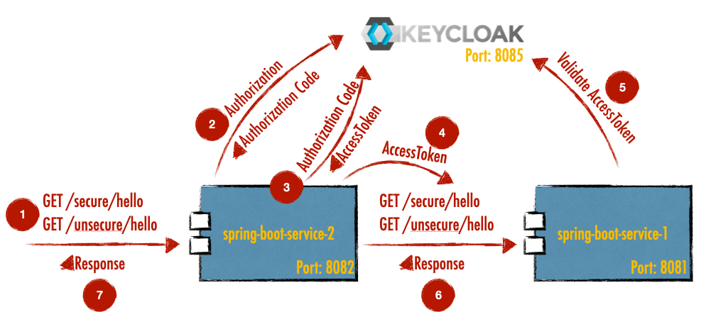

# Keycloak Spring Boot integration example

Simple example using keycloak and bind two spring boot services with rest api.



## Used technologies

* Spring Boot 2.5.3
* Java 11
* Keycloak 13.0.1
* Postgres 13.3 (Keycloak database)

## Requirements

* Java 11
* Maven >= 3.2.1
* Docker >= 3.0 (to run Keycloak)

## Build project

### Clone project

```sh 
$ git clone https://github.com/larmic/spring-boot-keycloak
```

### Keycloak

Check the [Keycloak setup](keycloak/readme.md) to start a Keycloak service

After installing Keycloak and register service clients, roles and users you can start Keycloak and retrieve an `access token`.

```sh 
$ cd keycloak && docker compose up
$ curl -X POST 'http://localhost:8085/auth/realms/spring-boot-services/protocol/openid-connect/token' \
 --header 'Content-Type: application/x-www-form-urlencoded' \
 --data-urlencode 'grant_type=password' \
 --data-urlencode 'client_id=spring-boot-service-1' \
 --data-urlencode 'username=larmic' \
 --data-urlencode 'password=test'
```

### Spring Boot Services

#### Build services

```sh 
$ mvn -f spring-boot-keycloak-service-1/pom.xml clean package
$ mvn -f spring-boot-keycloak-service-2/pom.xml clean package
```

#### Start services

```sh 
$ mvn -f spring-boot-keycloak-service-1/pom.xml spring-boot:run
$ mvn -f spring-boot-keycloak-service-2/pom.xml spring-boot:run
```

### Test services

#### You can call REST services in your browser

[Unsecure hello of service 1](http://localhost:8081/unsecure/hello)

[Unsecure hello of service 2](http://localhost:8082/unsecure/hello) calls service 1

[Unsecure hello of service 1](http://localhost:8081/secure/hello) redirects to Keycloak

[Unsecure hello of service 2](http://localhost:8082/secure/hello) redirects to Keycloak and calls service 1

#### Or you can use command line

```sh 
$ curl -i http://localhost:8081/unsecure/hello
$ curl -i http://localhost:8082/unsecure/hello
```

Without sending an `access token` to secured services you will get a redirect

```sh 
$ curl -i http://localhost:8081/secure/hello
HTTP/1.1 302
...
Date: Mon, 14 Jun 2021 09:47:20 GMT
```

#### Get and copy `access token` and add authorization header

```sh 
$ curl -X POST 'http://localhost:8085/auth/realms/spring-boot-services/protocol/openid-connect/token' \
 --header 'Content-Type: application/x-www-form-urlencoded' \
 --data-urlencode 'grant_type=password' \
 --data-urlencode 'client_id=spring-boot-service-1' \
 --data-urlencode 'username=larmic' \
 --data-urlencode 'password=test'
 
$ curl -H "Authorization: Bearer <ACCESS_TOKEN>" http://localhost:8081/secure/hello
```